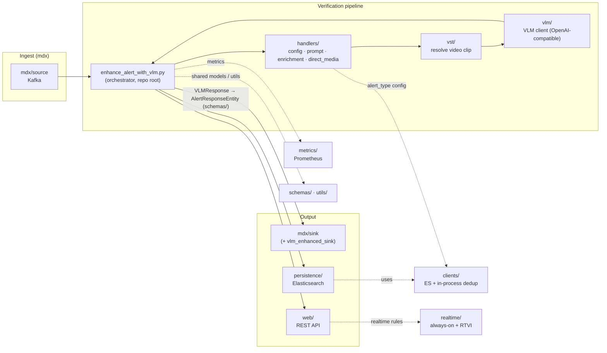

<!--
SPDX-FileCopyrightText: Copyright (c) 2025-2026, NVIDIA CORPORATION & AFFILIATES. All rights reserved.
SPDX-License-Identifier: Apache-2.0
-->

# Alert Verification — Source Layout

This directory (`src/`) holds all importable Python packages for the **Alerts
microservice**. The service ingests alerts/incidents produced by the VSS
pipeline and uses a Vision-Language Model (VLM) to **confirm, classify, and
enrich** them.

> The launcher lives one level up at `services/alert/enhance_alert_with_vlm.py`.
> It puts `src/` on `sys.path` and wires the packages below into the running
> pipeline. Tests rely on `services/alert/conftest.py`, which also adds `src/`
> to the path, so imports are written top-level (e.g. `from vlm.vlm_client import VLMClient`).

## High-level data flow

Two secondary entry paths share the same packages:
- **`web/`** — FastAPI app (REST `/api/v1/...`) for alert submission,
  on-demand verification, and config management.
- **`realtime/`** — always-on / realtime alert rules driven by the RTVI VLM client.

## Top-level packages

| Package | Responsibility |
|---|---|
| `mdx/` | **Alert ingestion transport** (NvSchema). Kafka sources/sinks; protobuf schemas; dedup fingerprints. |
| `handlers/` | **Core alert handlers** — alert-type config store, prompt rendering, enrichment, direct-media mode, exception handling, async mixins. |
| `vlm/` | **VLM client** (OpenAI-compatible NIM): sync/async clients, async runtime, NIM warmup. |
| `vst/` | **VST video-storage client** — resolves the video segment for an alert from `sensorId` + timestamps (timelines, clip extraction). |
| `schemas/` | **Data models / NvSchema entities** — request/response entities, VLM response model + pluggable parser registry, shared enums, config defaults. |
| `custom_parsers/` | **Sample/pluggable VLM-response parsers**, loaded dynamically via config. |
| `clients/` | **Low-level external-service clients + state** — Elasticsearch (`ElasticClient`) and the in-process dedup/verdict-protection handler (`DedupStateHandler`, exported as `RedisHandler` for back-compat). |
| `persistence/` | **Durable storage abstraction** (`PersistenceStore` ABC + Elasticsearch implementation, factory, config). |
| `utils/` | **Shared utilities** — config loader, logging, time/ISO helpers, event/schema helpers, URL transform. |
| `metrics/` | **Prometheus metrics** — definitions, recorder helpers, multiprocess setup. |
| `web/` | **FastAPI app** — REST routers, API schemas, services. |
| `realtime/` | **Realtime & always-on alert rules** — services, rule store, RTVI VLM client, schemas, config. |
| `webhook/` | **Outbound webhook notifications** (e.g. OpenClaw notifier). |
| `tools/` | **Operational CLI** placeholder (no scripts currently). |

## Key subpackages

### `mdx/` — ingestion transport
| Path | Purpose |
|---|---|
| `mdx/source/` | Input sources: `source_kafka`, `source_elasticsearch`, `source_base`. |
| `mdx/sink/` | Output sinks: `sink_kafka`, `sink_base`. |
| `mdx/sink/vlm_enhanced_sink/` | Writes the **enriched** result to Kafka/Elasticsearch. |
| `mdx/protobuf/` | Generated NvSchema protobuf (`Behavior`, `Incident`). *Auto-generated — do not edit.* |
| `mdx/utils/elastic_ready.py` | Alert/incident fingerprints for dedup. |
| `mdx/event_bridge_factory.py` | Builds the configured source/sink. |

### `handlers/` — core handlers
| Path | Purpose |
|---|---|
| `handlers/alert_config/` | Per-alert-type config store (ES primary + in-process cache/fallback, hydration, factory, service, `normalize`). |
| `handlers/prompt_handler/` | Prompt rendering + `alert_type_config` loading. |
| `handlers/enrichment/` | Enrichment processor. |
| `handlers/direct_media/` | Direct-media mode: downloader, analyzer, handler. |
| `handlers/exception_handler/` | Error handler + VSS exception types. |
| `handlers/async_*_mixin.py` | Async dispatch / external-IO / VLM-mode mixins for the orchestrator. |

### `schemas/` — data models
| Path | Purpose |
|---|---|
| `schemas/vlm_responses.py` | `VLMResponse` + model-type detection + parser registry. |
| `schemas/pluggable_parser_runtime.py`, `base_response_parser.py` | Pluggable response-parser machinery. |
| `schemas/request_entity/` | `AlertRequestEntity`, builder, validator. |
| `schemas/response_entity/` | `AlertResponseEntity`, `ResponseBuilder`. |
| `schemas/shared/` | Shared enums + exceptions. |
| `schemas/config/` | Request defaults loader. |

### `web/` — FastAPI app
| Path | Purpose |
|---|---|
| `web/main.py` | App assembly (routers, middleware, lifecycle). |
| `web/api/` | Routers: alerts, incidents, realtime, verification, alert-config. |
| `web/schemas/` | Pydantic request/response models for the API. |
| `web/core/` | `AlertSubmissionService` + dependencies (config). |
| `web/service/` | On-demand verification service. |

### `realtime/` — realtime rules
| Path | Purpose |
|---|---|
| `realtime/services/` | `realtime_service`, `always_on_service`, `incident_service`, `rule_store`, `rtvi_client` (RTVI VLM client). |
| `realtime/schemas/` | Alert-config + always-on-config schemas. |
| `realtime/config/` | Service config + constants. |

## Conventions

- **Imports are top-level** (`from <package>... import ...`); `src/` is placed on
  `sys.path` by the launcher (runtime) and `conftest.py` (tests).
- **`clients/`** holds connection wrappers; higher layers (`persistence/`,
  `handlers/alert_config/`, `web/`) compose on top of them.
- **`mdx/`** keeps its legacy name (NvSchema "anomaly" transport); `vst/` is the
  VST video-storage client used to resolve an alert's video clip.
